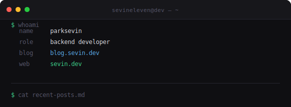
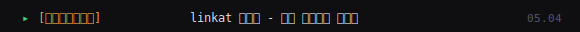
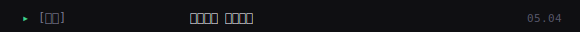

<table border="0" cellspacing="0" cellpadding="0">
<tr><td></td></tr>
<tr><td></td></tr>
<tr><td></td></tr>
<tr><td></td></tr>
<tr><td></td></tr>
<tr><td></td></tr>
<tr><td></td></tr>
<tr><td></td></tr>
<tr><td></td></tr>
</table>

